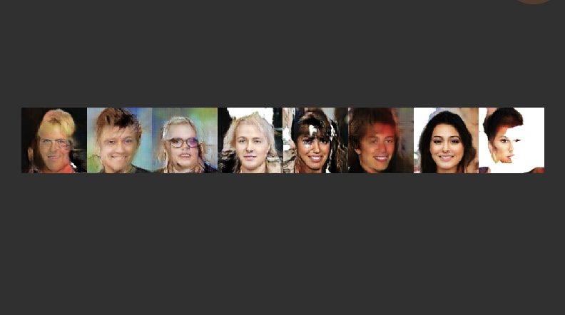

# Image Generation

Image generation using GAN, with CIFAR-10 and Celeb-A



## Implemented Variations

- [X] DCGAN (Deep Convolutional GAN)
- [X] WGAN-WC (Wasserstein GAN with Weight Clipping)
- [X] WGAN-GP (Wassertstein GAN with Gradient Clipping)

## Build and Run

With `uv` installed

```bash
# Clone the repo
git clone git@github.com:hmzdot/imgen.git
cd imgen

# Install dependencies
uv sync

# Run training
# Under the hood it calls `uv run python -m bin.train`
# (This generates snapshots/dw_{timestamp}.pth and snapshots/gw_{timestamp}.pth)
uv run train --model=dcgan --dataset=cifar10
uv run train --model=wgan_wc --dataset=cifar10
uv run train --model=wgan_gp --dataset=celeba
uv run train --help

# Generate a random image
# Under the hood it calls `uv run python -m bin.eval`
# Takes generator network's weights as the input
uv run eval snapshosts/gw_{timestamp}.pth
uv run eval snapshosts/gw_{timestamp}.pth --img_size=128 # For Celeb-A
uv run eval --help
```
